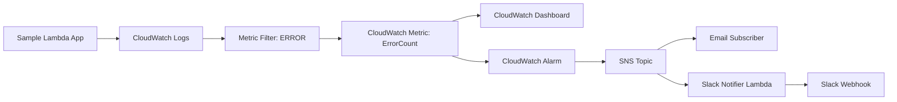

# Cloud Log Monitoring & Alert System

A lightweight, AWS-native monitoring stack that watches application logs, alerts on error spikes, and visualizes them in a real-time dashboard.

Built with **CloudWatch Logs**, **CloudWatch Metric Filters**, **CloudWatch Alarms**, **SNS**, and **Lambda**.


## What It Does

- **Collects structured logs** from a sample serverless Lambda app.
- **Counts ERROR-level logs** in near real-time using CloudWatch Logs metric filters.
- **Triggers alerts** when the 5-minute error count exceeds a configurable threshold.
- **Notifies via email** (SNS) and can forward to **Slack** via a Lambda notifier.
- **Provides two dashboards**:
  - A managed CloudWatch dashboard in AWS.
  - A lightweight, self-hosted dark-themed dashboard (`scripts/dashboard.py`).

## Architecture



For more details, see [docs/ARCHITECTURE.md](docs/ARCHITECTURE.md) and [docs/PRD.md](docs/PRD.md).

## Project Structure

```
.
├── docs/
│   ├── PRD.md              # Product Requirements Document
│   └── ARCHITECTURE.md     # System architecture
├── scripts/
│   ├── dashboard.py        # Local real-time dashboard (dark theme, Chart.js)
│   ├── mock_slack_server.py # Mock Slack server for local testing
│   ├── package.sh          # Builds Lambda deployment packages
│   └── test-local.sh       # End-to-end LocalStack test
├── src/
│   ├── sample_app/         # Lambda that emits JSON logs
│   └── slack_notifier/     # Lambda that forwards SNS alerts to Slack
├── terraform/
│   ├── main.tf             # Infrastructure definition
│   ├── variables.tf
│   ├── outputs.tf
│   └── terraform.tfvars.example
├── docker-compose.yml      # LocalStack + mock Slack
└── README.md
```

## Prerequisites

- AWS CLI configured with credentials (`aws configure`)
- Terraform >= 1.0
- `zip` command
- A Slack incoming webhook URL (optional, for Slack alerts)
- Python 3.11+ with a virtual environment

## Deploy to AWS

1. **Configure values**

   ```bash
   cd terraform
   cp terraform.tfvars.example terraform.tfvars
   # Edit terraform.tfvars with your email and Slack webhook URL
   ```

2. **Build Lambda packages**

   ```bash
   cd ..
   ./scripts/package.sh
   ```

3. **Initialize and apply Terraform**

   ```bash
   cd terraform
   terraform init
   terraform plan
   terraform apply
   ```

4. **Confirm the SNS email subscription**

   Check your inbox for the AWS confirmation email and click the link.

## Local Testing with LocalStack

A fully local reproduction runs against LocalStack.

```bash
pip install awscli-local awscli
./scripts/test-local.sh
```

The script boots LocalStack and a mock Slack server, deploys the stack, generates ERROR logs, and prints the alarm state, logs, and Slack captures.

### Cleanup

```bash
docker compose down -v
```

## Local Dashboard

`scripts/dashboard.py` is a small, self-contained Python HTTP server that shows:

- Alarm state badge
- Current 5-minute error count
- Line chart of error count over the last 30 minutes
- Recent ERROR logs table

It uses **AWS by default** (via the standard `boto3` credential chain). To point it at LocalStack:

```bash
export AWS_ENDPOINT_URL=http://localhost:4566
```

### Run

```bash
nohup .venv/bin/python scripts/dashboard.py > /tmp/dashboard.log 2>&1 &
```

Open http://localhost:8080.

The page auto-refreshes every 10 seconds.

## Test the Alarm

Generate ERROR logs by invoking the sample app with the error flag:

```bash
aws lambda invoke \
  --function-name cloud-log-monitor-sample-app-dev \
  --payload '{"error": true}' \
  --cli-binary-format raw-in-base64-out \
  /tmp/response.json
```

Repeat until the 5-minute error count exceeds the threshold (default: `5`). You will receive:

- An SNS email.
- A Slack message (if Slack webhook is configured).

The CloudWatch dashboard and the local dashboard will both reflect the alarm state.

## Useful CloudWatch Logs Insights Query

```sql
fields @timestamp, level, service, message, error, requestId
| filter level == "ERROR"
| sort @timestamp desc
| limit 20
```

## Teardown

```bash
cd terraform
terraform destroy
```

## License

MIT

---

Happy monitoring! 🔔
