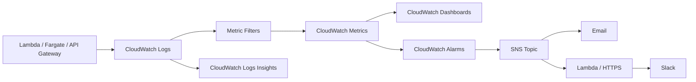

# Cloud Log Monitoring & Alert System — Architecture

## 1. High-Level Flow



## 2. Component Details

| Layer | Service | Role |
|---|---|---|
| **Source** | Lambda, Fargate, API Gateway | Generate application and access logs |
| **Ingestion** | CloudWatch Logs | Native serverless log collection |
| **Processing** | CloudWatch Logs Metric Filters | Extract counts from `ERROR` / `5xx` log lines |
| **Metrics** | CloudWatch Metrics | Store time-series data for alarms and dashboards |
| **Visualization** | CloudWatch Dashboards | Display error trends and log tables |
| **Alerting** | CloudWatch Alarms | Watch metrics and notify SNS |
| **Notification** | SNS + Lambda | Deliver email and Slack alerts |

## 3. Data Flow

1. **Applications emit JSON logs** to stdout. Lambda, Fargate, and API Gateway automatically ship these logs to CloudWatch Logs.
2. **Metric filters** in CloudWatch Logs scan incoming log events and increment CloudWatch Metrics for patterns like `level = ERROR` or HTTP `5xx` status codes.
3. **CloudWatch Alarms** evaluate the metrics against thresholds and publish to an SNS topic when breached.
4. **SNS** distributes notifications:
   - Direct email to subscribers.
   - Lambda / HTTPS endpoint that posts a formatted message to a Slack channel.
5. **CloudWatch Dashboards** pull metrics and Logs Insights query results for real-time visualization.
6. Engineers use **CloudWatch Logs Insights** to investigate alarms by filtering raw logs.

## 4. Example Logs Insights Query

```sql
fields @timestamp, level, service, message, error, requestId
| filter level == "ERROR"
| stats count() as errorCount by service, error
| sort errorCount desc
| limit 10
```

## 5. Example Slack Alert

```
🚨 CloudWatch Alarm: payment-service High Error Rate
Severity: High
Reason: Threshold Crossed: 8 errors in 5 minutes
Time: 2026-07-15 10:05 UTC
Dashboard: https://...cloudwatch/...
```

## 6. Design Notes

- **Serverless-first**: No persistent ingestion servers; all services are managed by AWS.
- **JSON logs**: Required for reliable metric filters and structured queries.
- **Single SNS topic**: Keeps notification routing simple; can be split by severity later if needed.
- **Log retention**: Set per log group (start with 14 days, archive to S3 if longer retention is needed).
